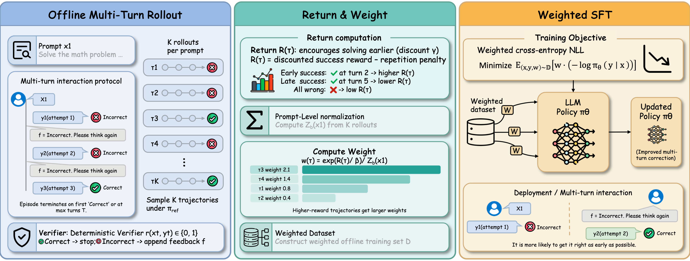

<div align="center">

<h1>DRIFT</h1>
<h3>Decoupled Rollouts and Importance-Weighted Fine-Tuning for Efficient Multi-Turn Optimization</h3>

<p>
  <a href=""></a>
  
  
</p>

</div>

DRIFT is a two-stage framework for efficient multi-turn optimization. Instead of running expensive online reinforcement learning rollouts at every policy update, DRIFT decouples data collection from optimization.

<div align="center">
  
</div>

The key idea is to sample correction trajectories from a fixed reference model, assign importance weights from trajectory returns, and train the target policy with weighted supervised fine-tuning. This keeps the simplicity and throughput of SFT while targeting the multi-turn behavior normally addressed by online RL.

## Setup

DRIFT only requires a Python environment with Python `>=3.10,<3.12`.

Using `venv`:

```bash
cd DRIFT
python3.11 -m venv .venv
source .venv/bin/activate
pip install -e .
```

Using `conda`:

```bash
cd DRIFT
conda create -n drift python=3.11 -y
conda activate drift
pip install -e .
```

Using `uv`:

```bash
cd DRIFT
uv sync
source .venv/bin/activate
```

## 1. Generate Rollout Data

Edit `scripts/run_generate_data.sh` before running:

- `MODEL_NAME_OR_PATH`: reference model used to sample rollouts.
- `OUTPUT_JSONL`: output path for generated trajectory data.
- `TENSOR_PARALLEL_SIZE`: number of GPUs used by vLLM.
- `MAX_PROMPTS` and `N_TRAJ`: number of prompts and trajectories per prompt.

Then run:

```bash
bash scripts/run_generate_data.sh
```

By default, the script samples MetaMathQA math prompts and writes trajectory JSONL data under `data/`. Each row contains multi-turn messages, verifier outputs, per-turn rewards, `t_star`, and metadata used by weighted SFT.

## 2. Train with Weighted SFT

The training script reads rollout JSONL data, computes DRIFT importance weights from `turn_rewards`, and trains only on the last assistant response in each trajectory.

Edit `scripts/run_weight_sft.sh` before running:

- `MODEL_NAME_OR_PATH`: base model to fine-tune.
- `TRAIN_JSONL`: rollout data generated in the previous step.
- `NUM_GPUS`: number of GPUs used by DeepSpeed.
- `ZERO_STAGE`: DeepSpeed ZeRO stage, currently `2` or `3`.

Then launch training:

```bash
bash scripts/run_weight_sft.sh
```

The default output directory is:

```text
outputs/weighted-sft/qwen2.5-3b-weighted-sft
```

## 3. Evaluate a Model

Edit `scripts/run_all_benchmark.sh` before running:

- `MODEL_NAME`: name used in the output JSON filename.
- `MODEL_NAME_OR_PATH`: model checkpoint to evaluate.
- `OUTPUT_ROOT`: directory for benchmark results.
- `TENSOR_PARALLEL_SIZE`: number of GPUs used by vLLM.

Then run:

```bash
bash scripts/run_all_benchmark.sh
```
